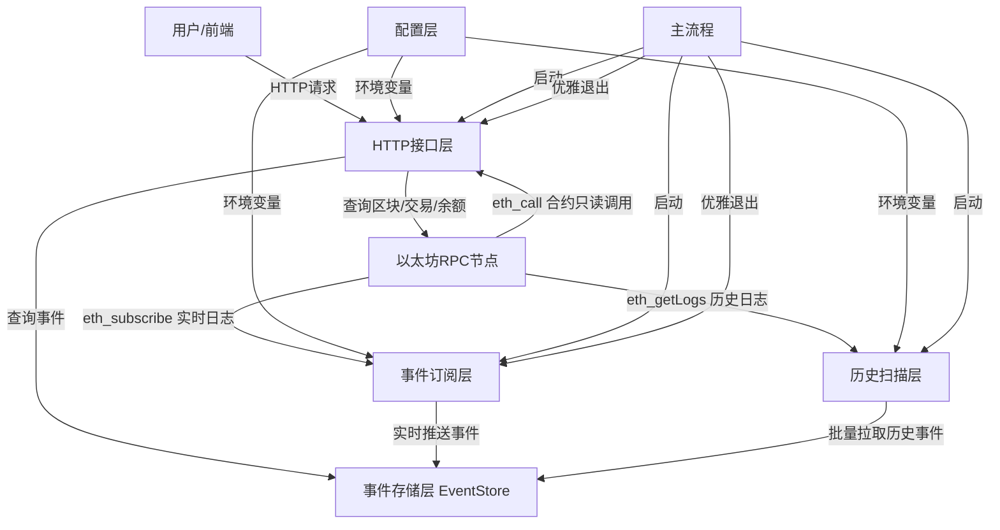
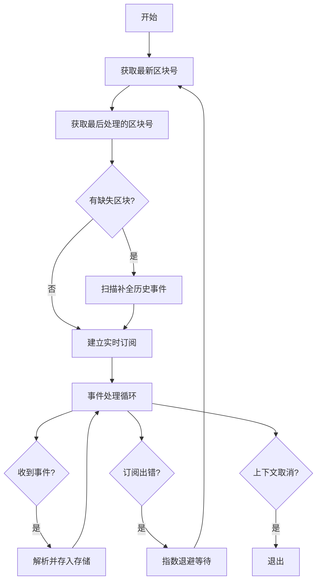
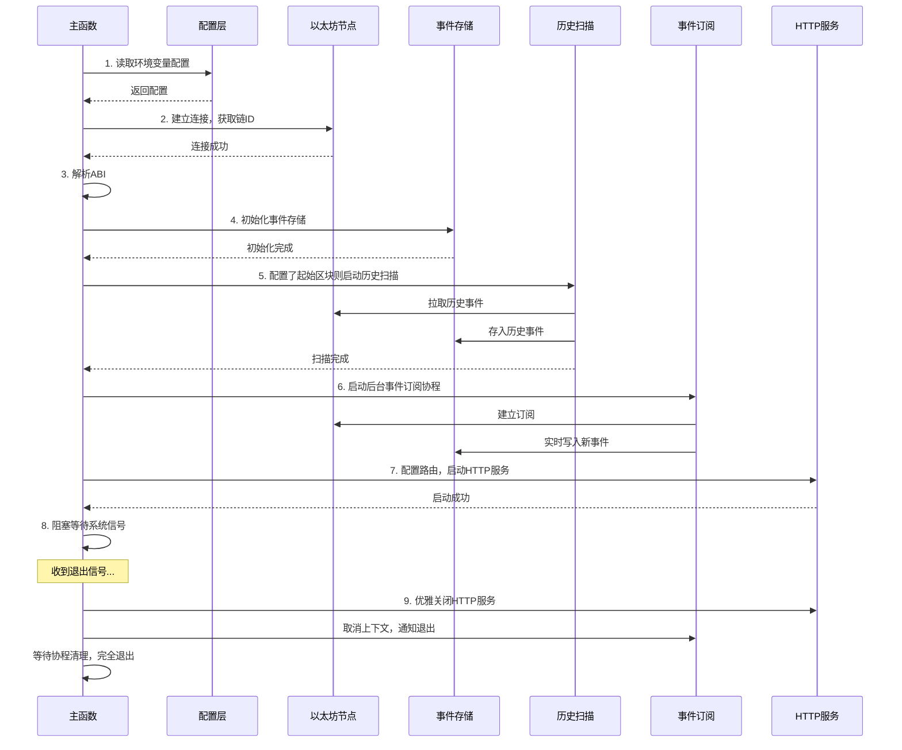

# Go以太坊实战：迷你区块浏览器与ERC20监听服务开发教材

---

## 一、教材说明

### 1\.1 适用人群

- 有 Go 语言基础，想入门 Web3 开发的开发者

- 已经学过 go\-ethereum 基础 API，想做实战项目的同学

- 想理解区块链索引服务底层原理的开发者

### 1\.2 学习目标

学完本教材你将掌握：

1. ✅ go\-ethereum 客户端的完整使用（区块 / 交易 / 余额 / 事件 / 合约调用）

2. ✅ ERC20 合约事件的订阅与解析原理

3. ✅ 并发安全的内存存储设计（读写锁 \+ 环形缓冲）

4. ✅ 生产级的断线重连与断点续传实现

5. ✅ 以太坊 HTTP API 服务的设计与开发

6. ✅ 服务优雅退出的标准实现

### 1\.3 前置知识

- Go 语言基础：语法、结构体、方法、接口、goroutine、channel

- 以太坊基础概念：区块、交易、Gas、地址、合约、事件、ABI

- go\-ethereum 基础：客户端连接、基本 API 使用

---

## 二、项目整体介绍

### 2\.1 项目功能清单

本项目是一个可直接运行的迷你以太坊区块浏览器与 ERC20 监听服务，包含以下功能：

| 功能分类 | 具体功能           | 说明                                           |
| -------- | ------------------ | ---------------------------------------------- |
| 基础查询 | 区块查询           | 支持按区块号 / 哈希查询，返回区块核心信息      |
|          | 交易查询           | 支持按哈希查询，返回交易信息 \+ 回执信息       |
|          | ETH 余额查询       | 查询指定地址的 ETH 余额                        |
|          | ERC20 代币余额查询 | 查询指定地址的 ERC20 代币余额，支持指定合约    |
| 事件监听 | 实时订阅           | 后台协程实时监听 ERC20 的 Transfer 事件        |
|          | 历史扫描           | 启动时可指定起始区块，回放历史事件             |
|          | 断点续传           | 断线重连后自动补全中间缺失的事件，不丢数据     |
|          | 并发安全存储       | 内存环形缓冲存储，支持并发读写                 |
| API 服务 | 统一响应格式       | 标准 JSON 响应，分页信息完整                   |
|          | 事件过滤分页       | 支持按地址过滤、分页查询事件                   |
|          | 首页导航           | 根路径返回 HTML 页面，展示所有接口             |
| 运维特性 | 优雅退出           | 捕获系统信号，平滑关闭 HTTP 服务和订阅协程     |
|          | 指数退避重连       | 断线后自动重连，等待时间指数增长，避免打满节点 |

### 2\.2 整体架构图



### 2\.3 技术栈说明

| 技术          | 版本     | 用途                       |
| ------------- | -------- | -------------------------- |
| Go            | 1\.18\+  | 开发语言                   |
| go\-ethereum  | v1\.13\+ | 以太坊客户端 SDK           |
| net/http      | 标准库   | HTTP 服务                  |
| sync\.RWMutex | 标准库   | 并发安全控制               |
| context       | 标准库   | 超时、取消、跨协程信号传递 |

---

## 三、环境准备

### 3\.1 依赖安装

```bash
# 初始化Go模块
go mod init mini-explorer

# 安装go-ethereum依赖
go get github.com/ethereum/go-ethereum
```

### 3\.2 环境变量配置

#### Windows PowerShell

```powershell
# 必填：RPC地址（推荐用WebSocket地址，支持事件订阅）
$env:ETH_WS_URL="ws://127.0.0.1:8545"
# 必填：要监听的ERC20合约地址
$env:ERC20_CONTRACT="0x你的合约地址"

# 可选：HTTP服务端口，默认:8080
$env:HTTP_ADDR=":8080"
# 可选：历史扫描起始区块，不配置则不扫描历史
$env:ERC20_START_BLOCK="100"
```

#### Mac/Linux Bash

```bash
export ETH_WS_URL="ws://127.0.0.1:8545"
export ERC20_CONTRACT="0x你的合约地址"
export ERC20_START_BLOCK="100"
```

### 3\.3 启动与验证

```bash
# 启动服务
go run main.go

# 验证启动成功
# 1. 浏览器打开 http://localhost:8080 查看首页
# 2. 调用区块查询：curl http://localhost:8080/api/block/1
# 3. 调用事件查询：curl http://localhost:8080/api/events
```

---

## 四、代码结构整体解析

### 4\.1 代码模块树形结构

```Plain Text
main.go（单文件MVP）
├── 常量与配置层
│   ├── ERC20 ABI常量
│   └── 默认配置常量
├── 数据模型层
│   ├── TransferEvent（转账事件）
│   ├── EventStore（事件存储）
│   ├── BlockInfo（区块响应）
│   ├── TxInfo（交易响应）
│   └── ApiResponse（统一响应）
├── 事件存储层（EventStore方法）
│   ├── NewEventStore（创建存储）
│   ├── Add（添加事件）
│   ├── List（查询事件：过滤+分页）
│   └── GetLastBlockNumber（获取最后区块号）
├── 工具函数层
│   ├── parseLog（事件解析）
│   ├── scanHistoricalEvents（历史扫描）
│   └── sleepWithContext（可取消睡眠）
├── 事件订阅层
│   └── subscribeTransferEvents（断点续传订阅）
├── HTTP接口层
│   ├── 响应工具函数（sendJSON/sendSuccess/sendError）
│   ├── homeHandler（首页）
│   ├── blockHandler（区块查询）
│   ├── txHandler（交易查询）
│   ├── balanceHandler（ETH余额查询）
│   ├── tokenBalanceHandler（ERC20余额查询）
│   └── eventsHandler（事件查询）
└── 主流程层
    └── main（启动+优雅退出）
```

### 4\.2 各模块职责说明

| 模块       | 职责                                     | 设计原则                 |
| ---------- | ---------------------------------------- | ------------------------ |
| 配置层     | 所有硬编码配置集中管理，支持环境变量覆盖 | 配置与代码分离           |
| 数据模型层 | 定义所有业务数据结构和 API 响应格式      | 统一数据结构，避免散落   |
| 存储层     | 负责事件的存储、查询、并发控制           | 存储与业务逻辑分离       |
| 工具函数层 | 通用的事件解析、历史扫描等工具方法       | 单一职责，可复用         |
| 订阅层     | 负责事件的实时订阅、重连、断点续传       | 专注订阅逻辑，与存储解耦 |
| 接口层     | 负责 HTTP 请求处理、参数校验、响应组装   | 接口与业务逻辑分离       |
| 主流程层   | 负责模块初始化、启动顺序、优雅退出       | 统一编排，职责清晰       |

---

## 五、核心模块深度解析

---

### 5\.1 配置与数据模型层

#### 5\.1\.1 ABI 常量设计

**核心代码**：

```go
const erc20ABIJSON = `[
  // Transfer事件定义
  // balanceOf方法定义
  // decimals方法定义
]`
```

**设计说明**：

1. **为什么用常量硬编码 ABI？**
   - MVP 阶段简化，不需要额外加载 ABI 文件

   - ERC20 是标准接口，ABI 固定，不会变化

   - 生产环境可以改成从文件 / 配置中心加载

2. **ABI 包含 3 个标准 ERC20 接口**：
   - `Transfer`事件：转账时触发，用于监听

   - `balanceOf`方法：查询代币余额，只读

   - `decimals`方法：查询代币精度，用于格式化余额

**常见坑点**：
⚠️ ABI 的事件名、参数类型、indexed 标记必须和合约完全一致，否则解析失败
⚠️ 事件的 indexed 参数数量要对应，Transfer 事件有 2 个 indexed 参数（from 和 to）

---

#### 5\.1\.2 核心数据结构体

**设计原则**：

1. 每个业务实体对应一个结构体

2. API 响应结构体加 json tag，统一命名风格（下划线）

3. 只返回需要的字段，不暴露原始的 go\-ethereum 类型

**核心结构体说明**：

| 结构体        | 用途         | 关键字段                                     |
| ------------- | ------------ | -------------------------------------------- |
| TransferEvent | 存储转账事件 | 区块号、交易哈希、from、to、value、时间      |
| BlockInfo     | 区块查询响应 | 区块号、哈希、父哈希、时间、交易数、Gas 信息 |
| TxInfo        | 交易查询响应 | 交易基础信息 \+ 回执信息（状态、GasUsed 等） |
| ApiResponse   | 统一响应格式 | code、message、data、分页信息                |

**常见坑点**：
⚠️ 以太坊的金额都是 uint256，Go 中必须用 \* big\.Int，不能用普通 int，会溢出
⚠️ 交易的 from 地址不能直接从交易对象获取，需要从签名中恢复

---

#### 5\.1\.3 统一 API 响应设计

**为什么要统一响应格式？**

1. 前端对接方便，所有接口返回结构一致

2. 错误处理统一，不用每个接口自己定义错误格式

3. 分页信息统一，前端分页组件可以通用

**响应格式说明**：

```json
{
  "code": 0, // 状态码：0成功，非0错误
  "message": "success", // 状态描述
  "data": {}, // 响应数据
  "total": 100, // 总条数（分页接口用）
  "page": 1, // 当前页码
  "page_size": 20, // 每页条数
  "pages": 5 // 总页数
}
```

**常见坑点**：
⚠️ 错误码要和 HTTP 状态码配合使用：参数错误 400，不存在 404，服务器错误 500
⚠️ 分页接口必须返回 total，不然前端不知道总共有多少页

---

### 5\.2 并发安全事件存储（EventStore）

#### 5\.2\.1 模块功能

- 在内存中存储最近 N 条转账事件

- 支持并发读写（订阅协程写，HTTP 接口读）

- 支持按地址过滤、分页查询

- 支持获取最后处理的区块号（用于断点续传）

- 环形缓冲设计，内存占用固定，不会无限增长

---

#### 5\.2\.2 核心数据结构

```go
type EventStore struct {
	mu     sync.RWMutex  // 读写锁：读共享、写独占
	events []TransferEvent // 事件切片
	limit  int           // 最大存储数量
}
```

**设计原理**：

1. **为什么用 sync\.RWMutex 而不是 sync\.Mutex？**
   - 事件存储是典型的**读多写少**场景：HTTP 查询是读，事件写入是写

   - 读写锁允许多个读协程同时持有锁，只有写的时候才独占

   - 读多写少场景下，读写锁性能比互斥锁高很多

2. **为什么用环形缓冲？**
   - 内存占用固定，不会因为事件太多导致 OOM

   - 满了自动丢弃最旧的事件，符合 “最近 N 条” 的需求

   - 实现简单，用切片就能实现

---

#### 5\.2\.3 核心函数逐行解析

##### ① NewEventStore \- 创建事件存储

**函数签名**：

```go
func NewEventStore(limit int) *EventStore
```

**功能**：创建一个新的事件存储实例，预分配切片容量
**参数**：limit \- 最大存储事件数量
**返回值**：EventStore 指针

**核心代码**：

```go
func NewEventStore(limit int) *EventStore {
	return &EventStore{
		events: make([]TransferEvent, 0, limit), // 预分配容量
		limit:  limit,
	}
}
```

**原理说明**：

- 用`make([]TransferEvent, 0, limit)`预分配容量，避免后续 append 时频繁扩容

- 切片扩容会导致内存拷贝，预分配可以提升性能

---

##### ② Add \- 添加事件（环形缓冲实现）

**函数签名**：

```go
func (s *EventStore) Add(e TransferEvent)
```

**功能**：添加一条新事件，超过限制时丢弃最旧的
**参数**：e \- 要添加的转账事件

**核心代码**：

```go
func (s *EventStore) Add(e TransferEvent) {
	s.mu.Lock()         // 加写锁（独占）
	defer s.mu.Unlock() // 函数退出时自动解锁

	if len(s.events) >= s.limit {
		s.events = s.events[1:] // 丢弃最旧的一条（切片第一个元素）
	}
	s.events = append(s.events, e) // 添加新事件到末尾
}
```

**步骤拆解**：

1. 加写锁：保证同一时间只有一个协程能写入，避免并发写导致的数据混乱

2. 判断是否达到上限：如果当前事件数 \>= 最大限制，执行环形缓冲逻辑

3. 丢弃最旧的：`s.events = s.events[1:]` 去掉第一个元素（最旧的）

4. 添加新事件：append 到切片末尾

5. 函数退出时自动释放写锁

**常见坑点**：
⚠️ 忘记加锁：并发写入会导致 panic 或者数据混乱
⚠️ 忘记 defer 解锁：如果中间 return 了，锁不会释放，导致死锁
⚠️ 环形缓冲是丢弃最旧的，不是拒绝新的，根据业务需求选择

---

##### ③ List \- 查询事件列表（过滤 \+ 分页 \+ 倒序）

**函数签名**：

```go
func (s *EventStore) List(address string, page int, pageSize int) (int, []TransferEvent)
```

**功能**：查询事件列表，支持地址过滤、分页，倒序返回（最新的在前面）
**参数**：

- address：过滤地址，为空则返回所有

- page：页码，从 1 开始

- pageSize：每页条数
  **返回值**：总条数、当前页事件列表

**核心步骤**：

1. 加读锁：多个读协程可以同时加锁，不阻塞

2. 地址过滤：遍历所有事件，匹配 from 或 to 地址

3. 分页参数校验：修正非法的页码和每页条数

4. 计算分页范围：倒序计算，最新的在前面

5. 组装分页数据：从后往前取，倒序返回

6. 释放读锁，返回结果

**原理说明**：

- **为什么倒序返回？** 用户看事件都是想看最新的，倒序符合浏览习惯

- **为什么地址要转小写？** 以太坊地址大小写不敏感，统一小写再比较，避免大小写不一致匹配失败

- **读锁是共享的**：多个 HTTP 请求可以同时读，不会互相阻塞

**常见坑点**：
⚠️ 分页边界处理不好容易越界：必须处理 start\<0、end\>total、start\>=end 等边界情况
⚠️ 地址过滤区分大小写：必须统一大小写再比较
⚠️ 返回的是切片副本：避免外部修改影响存储里的数据（本实现返回的是值拷贝，没问题）

---

##### ④ GetLastBlockNumber \- 获取最后处理的区块号

**函数签名**：

```go
func (s *EventStore) GetLastBlockNumber() uint64
```

**功能**：获取最后一条（最新的）事件的区块号，用于断点续传
**返回值**：最后一条事件的区块号，没有事件返回 0

**核心代码**：

```go
func (s *EventStore) GetLastBlockNumber() uint64 {
	s.mu.RLock()
	defer s.mu.RUnlock()

	if len(s.events) == 0 {
		return 0
	}
	return s.events[len(s.events)-1].BlockNumber
}
```

**设计用途**：

- 断点续传的核心：断线重连时，从这个区块号 \+ 1 开始扫历史事件，补全中间缺失的

- 保证数据不丢失：重连后不会重复处理，也不会漏掉

---

#### 5\.2\.4 并发安全原理（读写锁）

**读写锁的特性**：

| 锁类型 | 读锁                 | 写锁                     |
| ------ | -------------------- | ------------------------ |
| 读锁   | 共享，可同时加       | 互斥，必须等所有读锁释放 |
| 写锁   | 互斥，必须等写锁释放 | 互斥，只能有一个写锁     |

**适用场景**：读多写少的场景，比如缓存、配置、存储等
**性能对比**：读多写少场景下，读写锁比互斥锁吞吐量高很多

**常见坑点**：
⚠️ 读锁和写锁搞反：写操作用读锁，读操作用写锁，会出问题
⚠️ 锁的粒度太大：把不需要加锁的代码也放锁里，影响性能
⚠️ 死锁：读锁没释放就加写锁，或者写锁没释放就加读锁

---

#### 5\.2\.5 环形缓冲设计思路

**什么是环形缓冲？**

- 也叫循环队列，是一种固定大小的队列

- 满了之后，新元素会覆盖最旧的元素

- 内存占用固定，不会无限增长

**适用场景**：

- 只需要保留最近 N 条数据的场景

- 对历史数据不敏感，只关心最新数据的场景

- 内存受限的场景

**本项目的实现方式**：

- 用切片实现，满了就去掉第一个元素，append 新元素

- 简单直观，适合 MVP 阶段

- 生产环境可以用真正的环形数组实现，减少切片拷贝

---

### 5\.3 事件解析与历史扫描

#### 5\.3\.1 模块功能

- 解析原始的以太坊日志（types\.Log）为结构化的 TransferEvent

- 批量扫描指定区块范围的历史 Transfer 事件

- 复用同一套解析逻辑，保证实时订阅和历史扫描结果一致

---

#### 5.3.2 事件解析核心原理（Topics vs Data）

以太坊合约事件的存储分为两部分：

| 部分            | 存储位置    | 数量限制  | 是否可过滤             | 存储内容              |
| --------------- | ----------- | --------- | ---------------------- | --------------------- |
| Indexed 参数    | Topics 数组 | 最多 3 个 | 是（可以按值过滤事件） | 标记了 indexed 的参数 |
| 非 Indexed 参数 | Data 字段   | 无限制    | 否                     | 没标记 indexed 的参数 |

**Transfer 事件的存储结构**：

- Topics [0]：事件签名的 Keccak256 哈希（Transfer (address,address,uint256) 的哈希）

- Topics [1]：from 地址（第一个 indexed 参数）

- Topics [2]：to 地址（第二个 indexed 参数）

- Data：value 金额（非 indexed 参数，ABI 编码）

**解析规则**：

1. Indexed 参数：从 Topics 数组中取，address 类型需要去掉前 12 字节的 0 填充

2. 非 Indexed 参数：从 Data 字段中取，用 ABI\.Unpack 解码

**常见坑点**：
⚠️ Topics [0] 是事件签名哈希，不是第一个参数！很多初学者会搞错索引
⚠️ Indexed 的 address 是 32 字节，前 12 字节是 0，需要用 BytesToAddress 转换
⚠️ ABI.Unpack 只能解码 Data 字段，不能解码 Topics 里的 Indexed 参数

---

#### 5\.3\.3 核心函数逐行解析

##### ① parseLog \- 解析单个日志

**函数签名**：

```go
func parseLog(parsedABI abi.ABI, vLog types.Log) (TransferEvent, error)
```

**功能**：把原始的 types\.Log 解析成结构化的 TransferEvent
**参数**：

- parsedABI：解析后的 ABI 对象

- vLog：原始日志
  **返回值**：解析后的转账事件、错误

**核心步骤**：

1. 校验 Topics 长度：Transfer 事件至少要有 3 个 Topics（签名 \+ from\+to）

2. 解析非 Indexed 参数：用 ABI\.Unpack 解码 Data 字段，得到 value

3. 解析 Indexed 参数：从 Topics [1] 和 Topics [2] 中提取 from 和 to 地址

4. 组装成 TransferEvent 返回

**常见坑点**：
⚠️ 忘记校验 Topics 长度：如果日志不是 Transfer 事件，Topics 长度不够，会越界 panic
⚠️ ABI 的事件名写错：Unpack 的时候事件名要和 ABI 里的完全一致
⚠️ 参数顺序错：Indexed 参数的顺序要和 ABI 里的定义顺序一致

---

##### ② scanHistoricalEvents \- 扫描历史事件

**函数签名**：

```go
func scanHistoricalEvents(ctx context.Context, client *ethclient.Client,
	parsedABI abi.ABI, contract common.Address, store *EventStore,
	fromBlock uint64, toBlock uint64) (int, error)
```

**功能**：扫描指定区块范围的历史 Transfer 事件，解析后存入存储
**参数**：

- ctx：上下文，用于取消

- client：以太坊客户端

- parsedABI：解析后的 ABI

- contract：合约地址

- store：事件存储

- fromBlock：起始区块号（包含）

- toBlock：结束区块号（包含）
  **返回值**：扫描到的事件数量、错误

**核心步骤**：

1. 校验区块范围：起始大于结束直接返回

2. 构建过滤查询：指定合约地址、Transfer 事件哈希、区块范围

3. 调用 FilterLogs 接口查询历史日志（对应 RPC 方法：eth_getLogs）

4. 遍历所有日志，逐个解析，存入存储

5. 返回扫描到的事件数量

**原理说明**：

- **FilterLogs 是批量查询接口**：一次可以查一个区块范围的所有事件

- **和实时订阅的区别**：FilterLogs 是主动拉历史数据，SubscribeFilterLogs 是被动等推送

- **复用解析逻辑**：和实时订阅用同一个 parseLog 函数，保证结果一致

**常见坑点**：
⚠️ 区块范围太大：会触发 RPC 节点限流，建议分段扫描
⚠️ 节点不支持大范围查询：很多公共节点最多一次查 1000 个区块
⚠️ 扫描时间太长：历史区块多的话，启动会很慢，生产环境建议用数据库持久化

---

#### 5\.3\.4 历史扫描 vs 实时订阅的区别

| 维度     | 历史扫描（FilterLogs）       | 实时订阅（SubscribeFilterLogs） |
| -------- | ---------------------------- | ------------------------------- |
| 数据类型 | 历史已上链的事件             | 新产生的事件                    |
| 交互方式 | 主动拉取                     | 被动推送                        |
| 延迟     | 高（批量拉）                 | 低（实时）                      |
| 适用场景 | 启动补全历史、断点续传补中间 | 运行时实时监听                  |
| 协议支持 | HTTP/WS 都支持               | 必须 WS/WSS                     |
| 资源消耗 | 一次性消耗大                 | 长连接，持续消耗小              |

**行业标准架构**：历史扫描 \+ 实时订阅 组合

1. 冷启动：先扫历史，补全所有历史数据

2. 实时：扫完历史后，进入实时订阅模式

3. 断线：重连时先扫中间缺失的，再回到实时订阅（断点续传）

---

### 5\.4 断点续传式事件订阅

#### 5\.4\.1 模块功能

- 实时订阅 ERC20 的 Transfer 事件

- 断线后自动重连，指数退避等待

- 重连后自动补全断线期间的缺失事件（断点续传）

- 支持上下文取消，优雅退出

---

#### 5\.4\.2 整体设计思路（双层循环 \+ 指数退避）



**设计要点**：

1. **外层循环**：负责重连，每次重连前先补全缺失的历史事件

2. **内层循环**：负责处理实时事件，订阅出错就跳出内层循环，进入重连

3. **指数退避**：每次重连失败等待时间翻倍，避免频繁重试打满节点

4. **上下文感知**：所有阻塞点都监听上下文取消，保证优雅退出响应及时

---

#### 5\.4\.3 核心函数逐行解析

##### ① subscribeTransferEvents \- 断点续传订阅

**函数签名**：

```go
func subscribeTransferEvents(ctx context.Context, client *ethclient.Client,
	parsedABI abi.ABI, contract common.Address, store *EventStore)
```

**功能**：订阅 ERC20 Transfer 事件，带断点续传和自动重连
**参数**：

- ctx：上下文，用于取消订阅

- client：以太坊客户端

- parsedABI：解析后的 ABI

- contract：合约地址

- store：事件存储

**核心步骤拆解**：

1. **初始化**：设置初始重连等待时间，预计算 Transfer 事件哈希

2. **外层重连循环**：死循环，负责重连逻辑
   a\. 获取当前最新区块号
   b\. 获取最后处理的区块号
   c\. 如果有缺失，扫描补全中间的历史事件（断点续传核心）
   d\. 建立实时订阅
   e\. 订阅成功，重置重连等待时间

3. **内层事件循环**：处理实时事件
   a\. 收到新事件：解析并存入存储
   b\. 订阅出错：跳出内层循环，进入重连逻辑
   c\. 上下文取消：退出函数

4. **重连等待**：指数退避等待，支持上下文取消

**断点续传核心逻辑**：

```go
// 获取最后处理的区块号
lastProcessedBlock := store.GetLastBlockNumber()
if lastProcessedBlock > 0 && lastProcessedBlock < latestBlock {
    // 从最后处理的+1开始，到最新区块结束，扫描补全
    startBlock := lastProcessedBlock + 1
    scanHistoricalEvents(ctx, client, parsedABI, contract, store, startBlock, latestBlock)
}
```

**原理**：每次重连前，先把断线期间产生的事件补全，再进入实时订阅，保证数据不丢、不重复

---

##### ② sleepWithContext \- 可取消的睡眠

**函数签名**：

```go
func sleepWithContext(ctx context.Context, d time.Duration) bool
```

**功能**：带上下文取消的睡眠，返回 false 表示被取消了
**参数**：

- ctx：上下文

- d：睡眠时长
  **返回值**：true = 正常睡完，false = 被上下文取消

**为什么不用 time\.Sleep？**

- time\.Sleep 是阻塞的，无法被中断

- 程序退出时，如果正在 Sleep，要等 Sleep 完才能退，体验差

- 用 Timer\+select 可以监听 ctx 取消，提前退出睡眠，响应优雅退出

**核心代码**：

```go
func sleepWithContext(ctx context.Context, d time.Duration) bool {
	timer := time.NewTimer(d)
	defer timer.Stop() // 一定要Stop定时器，避免资源泄漏

	select {
	case <-timer.C:
		return true // 正常睡完
	case <-ctx.Done():
		return false // 被取消了
	}
}
```

**常见坑点**：
⚠️ 忘记 Stop 定时器：会导致定时器资源泄漏，虽然 Go 有 GC，但最好手动释放
⚠️ 用 time\.Sleep：导致优雅退出不及时，用户按 Ctrl\+C 还要等很久

---

#### 5\.4\.4 指数退避算法

**什么是指数退避？**

- 每次失败后，等待时间翻倍，直到达到最大值

- 公式：等待时间 = min \(最大等待时间，初始等待时间 × 2^ 失败次数\)

**为什么要用指数退避？**

1. **给节点恢复的时间**：刚断线立刻重试大概率还是失败

2. **避免触发限流**：频繁重试会被节点当成攻击，封 IP

3. **防止雪崩效应**：大量客户端同时重连，会把节点打挂

**本项目的实现**：

- 初始等待 1 秒，每次失败翻倍，最大 60 秒

- 订阅成功后重置等待时间为初始值

- 等待过程支持上下文取消

**常见坑点**：
⚠️ 忘记重置计数器：订阅成功后如果不重置，下次重连会从上次的大等待时间开始，体验差
⚠️ 没有最大等待时间：等待时间无限增长，断线很久后重连要等很久

---

#### 5\.4\.5 常见坑点

1. **用 HTTP 地址订阅**：HTTP 不支持 eth_subscribe，必须用 WS/WSS 地址

2. **订阅后不处理错误通道**：sub\.Err \(\) 一定要监听，不然断线了不知道

3. **日志通道没缓冲**：logsCh 如果没缓冲，处理慢了会阻塞订阅，导致丢事件

4. **重连时不补历史**：只重连不补中间的事件，会导致断线期间的数据丢失

5. **死循环重连不等待**：断线后立刻无限重试，会把节点打挂，也会把自己 CPU 跑满

---

### 5\.5 HTTP 接口层

#### 5\.5\.1 模块功能

- 提供 REST 风格的 HTTP API

- 统一的请求参数校验、响应格式、错误处理

- 包含区块、交易、余额、事件等查询接口

- 首页导航页面，方便查看接口

---

#### 5\.5\.2 统一响应设计

**三个工具函数**：

| 函数        | 用途                                        |
| ----------- | ------------------------------------------- |
| sendJSON    | 通用 JSON 响应，设置 Content\-Type 和状态码 |
| sendSuccess | 成功响应快捷方法，code=0                    |
| sendError   | 错误响应快捷方法，code=HTTP 状态码          |

**设计好处**：

- 所有接口响应格式统一，前端对接方便

- 避免每个接口重复写 JSON 编码代码

- 统一错误处理，错误格式一致

---

#### 5\.5\.3 核心接口逐行解析

##### ① 区块查询接口

**路由**：`GET /api/block/{number_or_hash}`
**功能**：根据区块号或区块哈希查询区块信息
**参数**：路径参数，区块号（如 12345）或区块哈希（0x 开头）

**核心逻辑**：

1. 从 URL 路径提取参数

2. 判断参数是区块号还是哈希（0x 开头 \+ 66 位 = 哈希，否则是区块号）

3. 调用对应的客户端方法查询区块

4. 把原始 types\.Block 转成自定义的 BlockInfo（只返回需要的字段）

5. 返回成功响应

**常见坑点**：
⚠️ 区块哈希格式判断错误：长度不对或者前缀不对，会导致解析失败
⚠️ 直接返回原始 types\.Block：字段太多，很多不需要的，也会暴露内部结构

---

##### ② 交易查询接口

**路由**：`GET /api/tx/{hash}`
**功能**：根据交易哈希查询交易详情，包含交易信息和回执信息
**参数**：路径参数，交易哈希

**核心逻辑**：

1. 提取并校验交易哈希格式

2. 查询交易本身，得到交易对象和是否 pending

3. 从签名中恢复发送方地址（交易本身不存 from）

4. 查询交易回执（只有已打包的交易才有回执）

5. 组装响应，同时返回原始值和人类可读的 ETH 单位

6. pending 交易的回执信息留空

**常见坑点**：
⚠️ 直接从交易对象取 from：交易里没有 from 字段，必须用 Sender 恢复
⚠️ 用错签名器：必须用对应链 ID 的签名器，不然恢复的地址不对
⚠️ pending 交易查回执：pending 交易还没上链，没有回执，会报错

---

##### ③ ETH 余额查询接口

**路由**：`GET /api/balance/{address}`
**功能**：查询指定地址的 ETH 余额
**参数**：路径参数，以太坊地址

**核心逻辑**：

1. 提取并校验地址格式

2. 调用 BalanceAt 查询最新区块的余额

3. 同时返回原始 wei 值和转成 ETH 的可读值

4. 返回成功响应

**常见坑点**：
⚠️ 用普通 int 存余额：会溢出，必须用 \* big\.Int
⚠️ 直接转 float64：精度会丢失，要用 big\.Float 转换

---

##### ④ ERC20 代币余额查询接口

**路由**：`GET /api/token-balance/{address}?contract=xxx`
**功能**：查询指定地址的 ERC20 代币余额，支持指定合约
**参数**：

- 路径参数：要查询的地址

- query 参数：contract，可选，合约地址，默认用配置的

**核心步骤**：

1. 提取并校验地址格式

2. 获取合约地址（优先 query 参数，否则默认）

3. 编码 balanceOf 方法的调用数据（ABI\.Pack）

4. 调用 CallContract 执行只读方法（不上链、不耗 Gas）

5. 解码返回值，得到原始余额

6. 可选：查询代币精度 decimals，转成人类可读单位

7. 组装响应返回

**合约只读调用原理**：

- CallContract 是本地执行，不会上链，不需要签名，不耗 Gas

- 对应 RPC 方法：eth_call

- 只能调用 view/pure 类型的方法，不能修改合约状态

**常见坑点**：
⚠️ ABI 的方法名写错：Pack 的时候方法名要和 ABI 里的完全一致
⚠️ 参数类型不匹配：参数类型要和 ABI 里的定义完全一致
⚠️ 调用会修改状态的方法：CallContract 执行不会真的修改状态，返回的是模拟执行结果

---

##### ⑤ 事件查询接口

**路由**：`GET /api/events?address=xxx&page=1&page_size=20`
**功能**：查询转账事件列表，支持地址过滤、分页
**参数**：

- address：可选，过滤涉及该地址的事件

- page：可选，页码，默认 1

- page_size：可选，每页条数，默认 20，最大 100

**核心逻辑**：

1. 读取 query 参数

2. 解析分页参数（解析失败用默认值）

3. 调用 EventStore\.List 查询

4. 计算总页数

5. 组装带分页信息的响应返回

---

##### ⑥ 首页导航

**路由**：`GET /`
**功能**：返回一个简单的 HTML 页面，展示所有接口说明
**好处**：不用记接口地址，打开首页就能看所有接口和参数说明

---

#### 5\.5\.4 合约只读调用原理（CallContract）

**什么是只读调用？**

- 调用合约的 view/pure 方法，不会修改合约状态

- 节点本地模拟执行，不需要签名，不需要 Gas，不会上链

- 适合查询数据，比如余额、总量、精度等

**和发送交易的区别**：

| 维度         | 只读调用（Call） | 发送交易（Send Transaction） |
| ------------ | ---------------- | ---------------------------- |
| 是否上链     | 否               | 是                           |
| 是否耗 Gas   | 否               | 是                           |
| 是否需要签名 | 否               | 是                           |
| 延迟         | 低（本地执行）   | 高（等打包）                 |
| 用途         | 查询数据         | 修改状态（转账、调用方法）   |

**调用步骤**：

1. 用 ABI\.Pack 编码方法名和参数，得到 data

2. 构造 CallMsg，指定合约地址和 data

3. 调用 client\.CallContract 执行，得到返回结果

4. 用 ABI\.Unpack 解码返回结果

---

### 5\.6 主流程与优雅退出

#### 5\.6\.1 启动流程 9 步拆解



**启动顺序说明**：

1. 先读配置：所有配置先加载，后面的模块都依赖配置

2. 再连节点：连接失败直接退出，不用初始化后面的

3. 解析 ABI：ABI 解析失败也直接退出

4. 初始化存储：存储是基础，后面的扫描和订阅都要用到

5. 历史扫描：先扫历史，再启动实时订阅，避免数据重复或遗漏

6. 启动订阅：后台协程运行，不阻塞主流程

7. 启动 HTTP：后台协程运行，不阻塞主流程

8. 等待信号：主流程阻塞，等退出信号

9. 优雅退出：按顺序关闭资源

---

#### 5\.6\.2 优雅退出实现原理

**什么是优雅退出？**

- 收到退出信号后，不是立刻强制退出

- 而是先完成正在处理的请求，保存好数据，关闭所有资源，再退出

- 好处：不会丢数据，不会中断用户请求，不会导致资源泄漏

**本项目的优雅退出步骤**：

1. 捕获系统信号（SIGINT=Ctrl\+C，SIGTERM=kill 命令）

2. 关闭 HTTP 服务：等所有正在处理的请求完成，再关闭

3. 取消根上下文：通知所有子协程（订阅协程）退出

4. 等待 1 秒：给子协程时间清理资源

5. 完全退出

**核心技术点**：

- `signal.Notify`：捕获系统信号

- `server.Shutdown`：HTTP 服务优雅关闭

- `context.Cancel`：跨协程传递取消信号

- 所有阻塞操作都监听上下文取消，保证能及时响应退出

**常见坑点**：
⚠️ 直接 os\.Exit：会立刻退出，正在处理的请求会中断，数据可能丢失
⚠️ 子协程不监听上下文取消：主协程退了，子协程还在跑，导致 goroutine 泄漏
⚠️ 不关闭资源：数据库连接、网络连接不关闭，资源泄漏

---

## 六、核心知识点背诵表

| 知识点       | 核心内容                                                       | 常见坑点                                  |
| ------------ | -------------------------------------------------------------- | ----------------------------------------- |
| 事件订阅     | SubscribeFilterLogs，WS 长连接，实时推送事件                   | HTTP 不支持，必须用 WS/WSS 地址           |
| 历史扫描     | FilterLogs，批量查询指定范围的历史事件                         | 范围太大触发节点限流，建议分段            |
| 事件结构     | Indexed 参数存 Topics（最多 3 个，可过滤），非 Indexed 存 Data | Topics [0] 是事件签名哈希，不是第一个参数 |
| 读写锁       | RWMutex，读共享写独占，适合读多写少                            | 忘记解锁导致死锁，锁粒度太大影响性能      |
| 环形缓冲     | 固定大小，满了丢最旧的，内存占用固定                           | 大小设置不合理，太小丢数据太大浪费内存    |
| 指数退避     | 失败后等待时间翻倍，避免频繁重试打满节点                       | 忘记成功后重置计数器，重连等待越来越长    |
| 合约只读调用 | CallContract，本地上执行，不上链不耗 Gas                       | 不能调用会修改状态的方法，结果是模拟的    |
| 优雅退出     | 信号捕获 \+ 上下文取消 \+ 资源清理                             | 直接强制退出，导致请求中断、数据丢失      |
| 交易发送方   | 交易本身不存 from，需要从签名中恢复                            | 用错链 ID 的签名器，恢复的地址不对        |
| 金额处理     | 以太坊金额都是 uint256，Go 用 \* big\.Int                      | 用普通 int 会溢出，转 float64 会丢精度    |

---

## 七、常见问题排错指南

| 错误现象                                        | 可能原因                                        | 解决方案                                   |
| ----------------------------------------------- | ----------------------------------------------- | ------------------------------------------ |
| 订阅失败：not supported                         | 用了 HTTP 地址订阅                              | 换成 WS/WSS 开头的地址                     |
| 连接被拒绝                                      | 节点没启动，或者端口错了                        | 先启动节点，确认 WS 端口是对的             |
| 事件解析失败：unpack log data failed            | ABI 不匹配，事件名 / 参数类型 /indexed 标记不对 | 核对合约 ABI，确保和代码里的完全一致       |
| 查不到历史事件                                  | 没配置 ERC20_START_BLOCK，或者起始区块太靠后    | 配置正确的起始区块，从合约部署区块开始扫   |
| 程序运行一段时间后 panic：concurrent map writes | 并发读写没加锁                                  | 检查 EventStore 的读写锁是否正确添加       |
| 重连越来越慢，要等很久                          | 指数退避的计数器没重置                          | 订阅成功后要把 reconnectWait 重置为初始值  |
| 调用合约返回空数据                              | 方法名写错，或者参数类型不对                    | 核对 ABI 的方法名、参数数量和类型          |
| 交易查询不到 from 地址                          | 直接从 tx\.From 取，没有用 Sender 恢复          | 用 types\.Sender 从签名中恢复发送方        |
| 余额显示不对，少了很多位                        | 直接转成 float64，精度丢失了                    | 用 big\.Float 转换，或者直接返回原始字符串 |
| 按地址过滤查不到事件                            | 地址大小写不一致                                | 统一转成小写再比较                         |

---

## 八、拓展练习方向

学完基础版本后，可以尝试以下拓展练习，提升能力：

### 初级拓展

1. **增加代币信息缓存**：缓存合约的名称、符号、精度，避免每次都查

2. **事件时间优化**：事件的时间用区块时间，而不是当前时间

3. **批量历史扫描**：大跨度历史扫描分段执行，避免触发限流

4. **增加 CORS 支持**：允许前端跨域调用

### 中级拓展

1. **持久化存储**：把事件存到 SQLite/PostgreSQL，支持更复杂的查询

2. **多合约支持**：同时监听多个 ERC20 合约，事件标记所属合约

3. **地址交易列表**：按地址索引交易，支持查询地址的所有转账记录

4. **监控告警**：大额转账、指定地址转账时触发告警（邮件 / 钉钉 / 短信）

### 高级拓展

1. **WebSocket 推送**：新增 WS 接口，实时推送新事件给前端

2. **多链支持**：同时支持多条链（以太坊、BSC、Polygon 等）

3. **合约 ABI 动态加载**：支持动态添加合约，不用改代码

4. **分布式部署**：多个实例部署，用消息队列解耦订阅和存储

5. **性能优化**：事件批量写入、索引优化、缓存热点数据

---

## 九、完整带注释代码附录

（完整带逐行注释的 main\.go 代码，见教材配套代码文件）

> （注：部分内容可能由 AI 生成）

```

```
